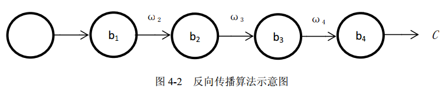

# 《PyTorch机器学习从入门到实战》- 勘误

工作之余编著本书，但自认才疏学浅, 对深度学习仅略知皮毛, 更兼时间和精力所限, 书中错谬之处依然甚多, 虽多次审稿修正，但错误仍在所难免, 若蒙读者诸君不吝告知, 将不胜感激。—— 修改自[西瓜书勘误修订](http://cs.nju.edu.cn/zhouzh/zhouzh.files/publication/MLbook2016.htm#%E5%8B%98%E8%AF%AF%E4%BF%AE%E8%AE%A2)

欢迎提[issue](https://github.com/xiaobaoonline/pytorch-in-action/issues)指出书中错误或不当之处。

## 2018年11月12日 [@jianchengss](https://github.com/jianchengss)
- p73，图4-2用错，应修正为

